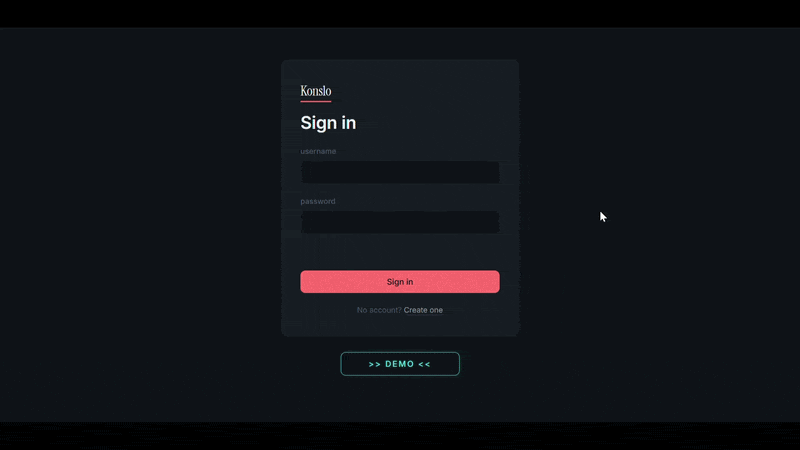

# Konslo

A minimalist habit tracking app built with a Rust backend and Angular frontend.

> https://konslo.up.railway.app

### Demo



### Stack

Rust · Angular 21 · PostgreSQL · Docker · Railway

### Features

- Create and manage habits with daily, weekly, or monthly goals
- Browse habit history by date
- JWT authentication
- Sandboxed pre-seeded demo account
- Containerized with Docker, deployed on Railway

### Run locally

```bash
docker compose up --build
```

Then open http://localhost
